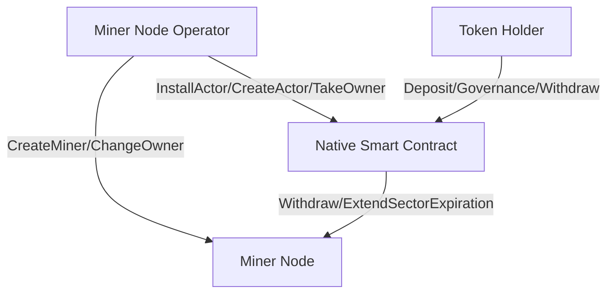

# FIL Peggy: $\mathbb{\color{#1e46a2}{Manage \ your \ \ miner \ with \ FVM}}$
### ${\color{blue}Let \space your \space friends \space invest \space your \space miner \space through \space smart \space contract \space directly}$

[](https://github.com/NpoolFilecoin/fil-peggy/actions/workflows/test.yml)

## ${\color{blue}{1 \ Overview}}$

When user want to run a Filecoin miner node, they need to have an account or multisig account, then they can create miner. Account which is used to create the miner is the owner of the miner. The owner can send a request to network to change miner's owner to a new account. All management of miner can only be executed by owner. Mining reward will be withdrawed to owner, or some beneficiary account set by owner.

## ${\color{blue}{2 \ Problem}}$

We have three problems if miner is managed by an account whose private key is hold by one or several users.
* If the owner account is hold by the user who own the miner node, when the private key is lost, or stolen by someone else, then user cannot control miner anymore;
* if the miner node is operated by more than 1 users, they may use a multisig account as the owner. But as we know, if we want to keep the private key safe (not lost), the power of each private key is not fair, then some operator may union to do evil;
* When miner node operator want to let investor to invest their miner, then pay benefit to investors with future mining reward, token holder won't trust miner node operator so easy if owner private key is hold by somebody.

## ${\color{blue}{3 \ Solution}}$

With FVM, we can manage miner with smart contract. The smart contract implements all ability to manage miner. All strategies will be implemented and opened to all users who take part in to review. So all user can invoke the smart contract to trigger something, but what's triggered by them is always the same workflow. Currently FVM do not support to use smart contract as miner's worker address, but it may be supported in future, then we can also use smart contract as worker to secure smart contract fund.



### Miner Node Operator
* Create miner
* Create native smart contract, set smart contract parameter
  * Set operator fee
  * Set dataset fee
  * Set device holder fee
  * Etc
* Change miner's owner to smart contract
* Publish miner smart contract and investment term

### Native Actor
* Play as miner's owner
* Accept deposit from token holder and record deposit accounts and amount
* Distribute mining reward to deposited accounts according to amount ratio
* Mint nft of the amount
* Process nft transfer then transfer beneficiary account
* Transfer deposited FIL to pledge account or pledge smart contract
* Provide liquidity to user who want to withdraw before their collateral expired
* Upgrade work flow with governance of all deposited accounts

We'll benefit from using smart contract as miner's owner:
* The code of owner smart contract is open source, everybody can review the work flow;
* Smart contract implement the execution logic. Miner node operator create miner, then set miner's owner to smart contract. Smart contract won't accept change owner request again, so the miner will be managed by smart contract in its lifetime. Nobody can do anything which is not defined in smart contract. If the miner is owned by sereval partner, partner won't be worry about lose private key or some partners union to do evil anymore;
* Execution process of smart contract is transparent. It could be audited by everybody. Anybody can invoke the smart contract, but any invocation can only execute predefined process in the smart contract. With smart contract, all parties can know the details of the miner better;
* Mining reward distribution process is implemented in the smart contract. It'll be run with a cron process, or triggerd by somebody. We do not need someone to calculate the reward distribution anymore;
* Miner with smart contract owner can connect to more token holders, big or small. Token holder can invest any amount to smart contract, then just wait for reward;
* Amount of the smart contract can be minted to NFT, then the NFT could be transfered. New owner of the NFT can change the old amount beneficiary to theiry new acount.

## ${\color{blue}{4 \ FVM \ Validation}}$
### 4.1 CreateMiner with FVM

Native smart contract cannot create miner directly. Only account or multisig account can create miner. We don't know if it'll be supported by FVM in future.

### 4.2 Use smart contract address as miner's owner

Smart contract address could be used as miner's owner and could implement all owner functionality in the smart contract.

### 4.2 Record deposit (invoke smart contract with method 0 to send FIL to smart contract address) account inside smart contract

Actually currently we cannot know about who deposit FIL to smart contract address inside smart contract. Issue https://github.com/filecoin-project/ref-fvm/issues/835 let us know about that FVM team is considering about that. But even it cannot be supported, we still can use some half-decentralized method to implement this requirement.

### 4.3 Use smart contract address as miner's worker

Smart contract address cannot be used as miner's worker.

```All validation code could be found in ```https://github.com/kikakkz/fvm-actor-example.git

## ${\color{blue}{5 \ Peggy \ Smart \ Contract \ Functionalities}}$
* All funtionalities to manage miner
* Detect deposit to smart contract address inside smart contract
* Mining reward distribution according to amount ratio
* NFT minting and transferring of deposited amount
* Upgrade governance process

## ${\color{blue}{6 \ Product}}$
* FIL-Peggy Playground: One stop FIL-Peggy smart contract creation and management tool.
  * PC: Desktop version with rust and rust gui framework
  * Online: Network version, also support to show the history deposit and reward data from blockchain
  * Web3: Browser extension version, do not connect to any centralized server

## ${\color{blue}{7 \ Roadmap}}$
| Time  | Status |
| ------------- | ------------- |
| 2022-11-30  | Peggy Playground compilation architecture and workflow |
| 2022-12-20  | Finish host tool functionality and peggy smart contract code |
| 2023-01-10  | Peggy is deployed to testnet</br>Peggy website is online, support wallet connect, support create miner investment offer, support show history data |

## ${\color{blue}{8 \ Development \ Progress}}$
- [X] Support to create wallet
- [X] Support to create miner
- [X] Support to wait message to get action result
- [X] Extract common mpool api
- [X] Get noce before sign message
- [X] Support to estimate message gas
- [X] Add a fund account for new account create miner gas
- [X] Restructure command parameter and persistent method
- [X] Native actor code support take owner of miner
- [X] Compile native actor code
- [X] Install actor
- [X] Create actor
- [X] Host code support invoke take owner
- [ ] Native actor code support other miner action
  - [X] Native actor code support change worker
  - [X] Native actor code support withdraw miner balance
- [ ] Native actor code support deposit process (depend on FVM implementation)
- [ ] Native actor code support reward distribution
- [ ] Native actor code support deploy parameter setting
- [ ] NFT prototype with FVM
- [ ] Native actor code support mint NFT for deposit account
- [ ] Native actor code support NFT transfer process
- [ ] Native actor code support upgrade governance
- [ ] Terminal UI
- [ ] Desktop UI (Linux / Mac / Window)
- [ ] dApp implementation
- [ ] Peggy website - support miner create offer
- [ ] Peggy website - support display contract history data
- [ ] Peggy website - support miner reputation from on-chain data
- [X] Add CI/CD workflow
- [X] Executable file size optimization

## ${\color{blue}{9 \ Try \ it}}$
We still do not have a full version (and it may be available after a long time, :(). But we really have some preview feature could be tried.
### Compile
```cargo build```
### Run
* ```./target/debug/peggy cli create-miner```: create a new miner with generated or exist owner account
* ```./target/debug/peggy cli create-actor```: create actor with provided rust code, it'll compile/install/create actor
* ```./target/debug/peggy cli change-owner```: change the miner's owner to actor
* ```./target/debug/peggy cli custody-miner```: call actor to let it take the owner of miner

## ${\color{blue}{10 \ About}}$
We don't accept pull request currently. If you have any suggestion, or any issue when you try peggy, please kindly create an issue. Believe me, we'll reply to you.

## ${\color{blue}{11 \ Question \ About \ FVM}}$
* Q1: we know we cannot create miner through a native actor, but we can change miner's owner to a native actor. Is it a design or only a implementation flaw ?
* Q2: we know we cannot use a native actor as miner's worker currently, is it possible to use a native actor as miner's worker in future ?
* Q3: how about the issue #835 ? will we be able to detect method 0 invocation in native actor code ? will we be able to get who sent to the native actor ?
* Q4: do you have any suggestion about the security if we implement all miner's owner functionalities with a native actor ?
* Q5: Is self_destruct the only way to destroy an actor ? Does it mean that if the actor do not implement self_destruct, then it won't be deleted forever ?

## ${\color{blue}{12 \ Reference \ and \ Design \ of \ FIL-Peggy}}$
* [FIL-Peggy ETHGlobal Submit Page - Hack FEVM Finalist and Filecoin Pool Prize](https://ethglobal.com/showcase/fil-peggy-f77i2)
* [ETHGlobal Hack FEVM](https://ethglobal.medium.com/hack-fevm-2022-4d31781408b5)
* [FVM — About FIL-Peggy being ETHGlobal Hack FEVM finalist and using Actor as Owner](https://medium.com/@web3.0.eye/fvm-about-fil-peggy-being-ethglobal-hack-fevm-finalist-and-using-actor-as-owner-ff0a2a133d4c)
* [FVM — Guidance of Jim Pick’s FVM Playground](https://medium.com/@web3.0.eye/fvm-guidance-of-jim-picks-fvm-playground-b5b3c0ffb06b)
* [FVM — Create Miner with Smart Contract (Native Actor) and (Part 1)](https://medium.com/@web3.0.eye/fvm-fvm-create-miner-with-smart-contract-native-actor-and-part-1-9a5d03b41c31)
* [FVM - 用peggy将你的Miner托管到Native Actor](https://mp.weixin.qq.com/s/_3O_ceKQnLZbniUjHdU23g)
* [FVM - 关于FIL-Peggy入围ETHGlobal Hack HEVM finalist，以及用Actor作为Owner](https://mp.weixin.qq.com/s?__biz=MzIyMjY4NzU2Ng==&mid=2247483767&idx=1&sn=f7f49b178530ae7a3996db274e93f82f&chksm=e828f956df5f704041b45fb040fa8b2ce6d554e9f3ea8d6b45e96645db43645147704a491832&token=1769770941&lang=zh_CN#rd)
* [FVM - 将合约作为Owner创建Miner(一)](https://mp.weixin.qq.com/s?__biz=MzIyMjY4NzU2Ng==&mid=2247483757&idx=1&sn=3bec40882f06bbac9add0aceff6b59ee&chksm=e828f94cdf5f705aeb8ac81b67ee228edd9d57e280ef3ae9b8c9ed0c473e93455c548e20a5c8&token=1769770941&lang=zh_CN#rd)
* [FVM - 入坑指南](https://mp.weixin.qq.com/s?__biz=MzIyMjY4NzU2Ng==&mid=2247483740&idx=1&sn=b74142ca30186fb5df09dd594e18e03a&chksm=e828f97ddf5f706b5c3449422e953e052ac090bec20deddff354d84190755da7d2348f03c436&token=1769770941&lang=zh_CN#rd)

## ${\color{blue}{13 \ Actors}}$
* [Owner Actor Repo: https://github.com/NpoolFilecoin/fil-owner-actor.git](https://github.com/NpoolFilecoin/fil-owner-actor.git)
