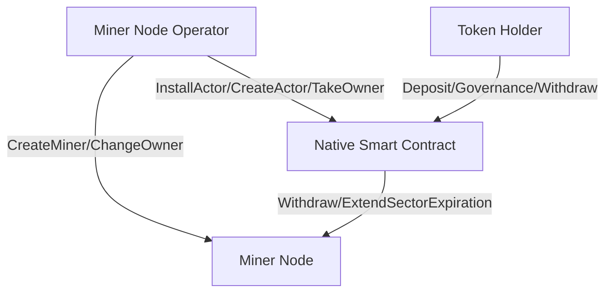

# FIL Peggy: $\mathbb{\color{#1e46a2}{Manage \ your \ a \ miner \ in \ with \ FVM}}$
### ${\color{blue}Let \space your \space friend \space invest \space your \space miner \space through \space smart \space contract \space directly}$

## 1 Overview

When user want to run a Filecoin miner node, they need to have an account or multisig account, then they can create miner. Account which is used to create the miner is the owner of the miner. The owner can send a request to network to change miner's owner to a new account. All management of miner can only be executed by owner. Mining reward will be withdrawed to owner, or some beneficiary account set by owner.

## 2 Problem

We have three problems if miner is managed by an account whose private key is hold by one or several users.
* If the owner account is hold by the user who own the miner node, when the private key is lost, or stolen by someone else, then user cannot control miner anymore;
* if the miner node is operated by more than 1 users, they may use a multisig account as the owner. But as we know, if we want to keep the private key safe (not lost), the power of each private key is not affair, then some operator may union to do evil;
* When miner node operator want to let investor to invest their miner, then pay benefit to investors with feature mining reward, token holder won't trust miner node operator so easy if owner private key is hold by somebody.

## 3 Solution

With FVM, we can manage miner with smart contract. The smart contract implements all ability to manage miner. All strategies will be implemented and opened to all users who take part in to review. So all user can invoke the smart contract to trigger something, but what's triggered by them is always the same workflow. Currently FVM do not support to use smart contract as miner's worker address, but it may be supported in future, then we can also use smart contract as worker

### Miner Node Operator
* Create miner
* Create native smart contract, set smart contract parameter
  * Set operator fee
  * Set dataset fee
  * Set device holder fee
  * Etc
* Change miner's owner to smart contract
* Publish miner smart contract and investment term

### Native Actor
* Play as miner's owner
* Accept deposit from token holder and record deposit accounts and amount
* Distribute mining reward to deposited accounts according to amount ratio
* Mint nft of the amount
* Process nft transfer then transfer beneficiary account
* Transfer deposited FIL to pledge account or pledge smart contract
* Provide liquidity to user who want to withdraw before their collateral expired
* Upgrade work flow with governance of all deposited accounts
